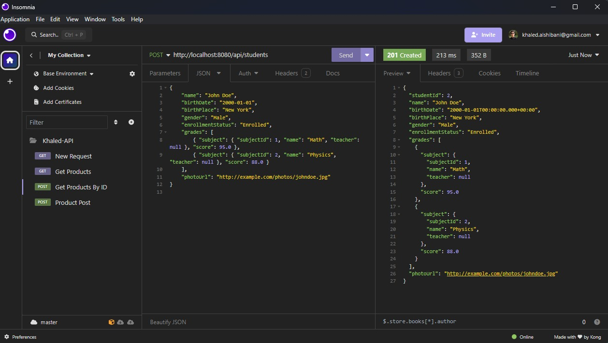
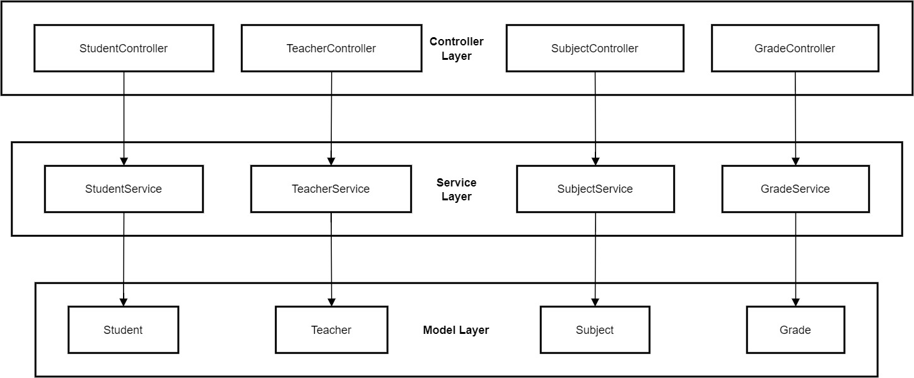

# Student Management API

The **Student Management API** is a fully independent, cross-platform API designed for managing a student database. Built with **Java** and the **Maven build system** on **Spring Boot**, this API follows an **N-tier architecture** with a **3-tier design pattern** to separate concerns and streamline code organization. Although it currently uses **in-memory ArrayLists** for data storage, it is designed to manage a database. Connecting to a database is the only missing step to enable full data persistence. Until then, the API interacts with and stores data in ArrayLists, meaning all data will reset upon server restart.

Spring Boot was chosen for its powerful tools and streamlined configuration, making it easy to develop robust and maintainable REST APIs. Maven further simplifies dependency management, ensuring efficient builds and compatibility across project components.

The API is hosted locally at `http://localhost:8080/api/...` and has a live example hosted at `https://student-management-api-production.up.railway.app/api/`, which includes endpoints like `https://student-management-api-production.up.railway.app/api/students`.

## TOC

- [Features](#features)
- [Development](#development)
- [Design Pattern](#design-pattern)
- [Endpoints](#endpoints)
  - [Student Endpoints](#student-endpoints)
  - [Teacher Endpoints](#teacher-endpoints)
  - [Subject Endpoints](#subject-endpoints)
  - [Grade Endpoints](#grade-endpoints)
- [Installation](#installation)
- [Usage](#usage)
- [Contributing](#contributing)
- [License](#license)

## Features

- **Cross-platform compatibility**: Integrates with mobile, web, and desktop clients.
- **CRUD operations**: Supports Create, Read, Update, and Delete operations for students, teachers, subjects, and grades.
- **In-memory data storage**: Data is stored in memory using ArrayLists (no persistence).
- **N-tier architecture**: Model, Service, and Controller layers separate concerns and improve maintainability.
- **RESTful design**: Adheres to REST principles for simplicity and standardization.

## Development

This API is developed using **Spring Boot**, making the setup and configuration of the RESTful API seamless and efficient. Spring Boot's framework allows for high-level abstractions and simplifies dependency management. Below are key tools and steps used in development:

- **Spring Boot**: Used for building and running the API.  
  

- **IntelliJ IDEA**: Used as the integrated development environment (IDE) for efficient Java and Spring Boot development, providing advanced code assistance and powerful debugging tools.

- **Insomnia**: API endpoints were tested through Insomnia to verify functionality.  
  

This API uses **N-tier architecture** with distinct **Model**, **Service**, and **Controller** layers for clear separation of concerns, as illustrated below:

### Design Pattern

The API is developed with an **N-tier design pattern** that includes three distinct layers:

1. **Model Layer**: Defines the data structures and entities like `Student`, `Teacher`, `Subject`, and `Grade`.
2. **Service Layer**: Contains business logic for managing entities and processing data. For example, `StudentService`, `TeacherService`, `SubjectService`, and `GradeService` manage CRUD operations for each entity.
3. **Controller Layer**: Exposes endpoints for interacting with the API, acting as the entry point for HTTP requests. Each entity has its own controller (e.g., `StudentController`, `TeacherController`) to handle requests and responses.

This structure makes the API modular, scalable, and easier to maintain, as each layer is dedicated to a specific responsibility.

#### N-tier Architecture Diagram



### Description of the N-tier Architecture

1. **Controller Layer**: This top layer handles incoming HTTP requests. Each controller, like `StudentController`, `TeacherController`, `SubjectController`, and `GradeController`, is responsible for receiving requests, interacting with the service layer, and returning appropriate HTTP responses.

2. **Service Layer**: This middle layer contains the core business logic of the application. Services such as `StudentService`, `TeacherService`, `SubjectService`, and `GradeService` process data, manage interactions between entities, and perform CRUD operations as needed. The service layer acts as a bridge between the controller and model layers.

3. **Model Layer**: The bottom layer defines the data structures that represent core entities in the system, including `Student`, `Teacher`, `Subject`, and `Grade`. This layer provides the foundation for the data used across the application.

This layered structure promotes a clean separation of concerns, making the code modular and maintainable, while allowing each layer to operate independently with specific responsibilities.

## Endpoints

### Student Endpoints

- **GET** `/api/students`  
  Retrieves a list of all students.

- **GET** `/api/students/{id}`  
  Retrieves a student by their unique ID.

- **POST** `/api/students`  
  Creates a new student.

- **PUT** `/api/students/{id}`  
  Updates an existing student's details.

- **DELETE** `/api/students/{id}`  
  Deletes a student by their unique ID.

### Teacher Endpoints

- **GET** `/api/teachers`  
  Retrieves a list of all teachers.

- **GET** `/api/teachers/{id}`  
  Retrieves a teacher by their unique ID.

- **POST** `/api/teachers`  
  Creates a new teacher.

- **PUT** `/api/teachers/{id}`  
  Updates an existing teacher's details.

- **PUT** `/api/teachers/{id}/subjects`  
  Adds subjects to an existing teacher.

- **DELETE** `/api/teachers/{id}`  
  Deletes a teacher by their unique ID.

### Subject Endpoints

- **GET** `/api/subjects`  
  Retrieves a list of all subjects.

- **GET** `/api/subjects/{id}`  
  Retrieves a subject by its unique ID.

- **POST** `/api/subjects`  
  Creates a new subject.

- **PUT** `/api/subjects/{id}`  
  Updates an existing subject's details.

- **DELETE** `/api/subjects/{id}`  
  Deletes a subject by its unique ID.

### Grade Endpoints

- **GET** `/api/grades`  
  Retrieves a list of all grades.

- **GET** `/api/grades/subject`  
  Retrieves a grade by its associated subject.

- **POST** `/api/grades`  
  Creates a new grade.

- **PUT** `/api/grades/subject`  
  Updates an existing grade's score based on the provided subject.

- **DELETE** `/api/grades/subject`  
  Deletes a grade associated with the specified subject.

## Installation

1. **Clone the repository:**
   ```bash
   git clone https://github.com/khaledsAlshibani/student-management-api
   cd student-management-api
   ```

### Example Requests

- **Get All Students:**
  ```bash
  GET /api/students
  ```

- **Add a Subject to a Teacher:**
  ```bash
  curl -X PUT http://localhost:8080/api/teachers/1/subjects \
  -H "Content-Type: application/json" \
  -d '[{"name": "Science", "teacher": {"teacherId": 1}}]'
  ```
